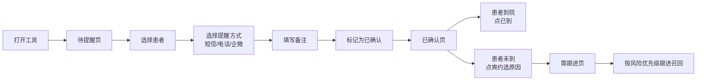

## 1. 产品概述

口腔诊所前台复诊提醒工具，专为平板端设计的极简效率工具。围绕当天和明天的复诊患者确认流程，帮助前台高效完成提醒、到诊核对和跟进召回，减少爽约率，提升诊所运营效率。

- 目标用户：口腔诊所前台接待人员
- 使用场景：每日晨间患者提醒、到诊登记、爽约患者跟进
- 核心价值：极简操作、信息聚焦、流程闭环

## 2. 核心功能

### 2.1 用户角色

| 角色 | 登录方式 | 核心权限 |
|------|----------|----------|
| 前台 | 无需登录（本地工具） | 查看患者列表、执行提醒操作、登记到诊/爽约、跟进管理 |

### 2.2 功能模块

1. **待提醒页**：按时间顺序展示当日及次日待提醒患者，支持一键提醒操作
2. **已确认页**：展示已确认患者，支持到诊登记与爽约标记
3. **需跟进页**：收拢爽约患者，按风险等级排序，辅助前台跟进召回

### 2.3 页面详情

| 页面名称 | 模块名称 | 功能描述 |
|----------|----------|----------|
| 待提醒页 | 顶部状态栏 | 显示日期、待提醒数量统计 |
| 待提醒页 | 患者列表 | 按预约时间升序排列，展示姓名、复诊项目、医生、时间、联系方式 |
| 待提醒页 | 提醒操作弹窗 | 选择短信/电话/企微三种提醒方式，填写备注信息 |
| 已确认页 | 已确认列表 | 展示已提醒确认的患者，按时间排序 |
| 已确认页 | 到诊操作 | 点击"已到"完成到诊登记 |
| 已确认页 | 爽约操作 | 点击"爽约"并选择原因（忘记时间/临时有事/联系不上/不愿继续治疗） |
| 需跟进页 | 跟进列表 | 展示爽约患者，显示距上次治疗天数，高风险病例置顶 |
| 需跟进页 | 风险标签 | 根管未完成、正畸复诊超期、种植术后拆线等高风险标识 |

## 3. 核心流程

前台每日打开工具 → 进入待提醒页 → 按顺序拨打/发送提醒 → 填写备注确认 → 切换已确认页核对到诊 → 患者到院点"已到" / 未到点"爽约"选原因 → 需跟进页定期回访高风险病例

## 4. 用户界面设计

### 4.1 设计风格

- **主色调**：薄荷绿（#2DD4BF）代表医疗健康、清新专业
- **辅助色**：珊瑚橙（#FB923C）用于提醒与强调，浅灰蓝用于状态标签
- **中性色**：以灰白为主背景，卡片白色带微妙阴影
- **按钮风格**：大圆角胶囊按钮，平板触摸友好，点击有按压反馈
- **字体**：使用现代无衬线字体，大字号保证平板可读性
- **布局风格**：卡片式列表，顶部Tab切换，整体极简清爽
- **图标风格**：线性简洁图标，与文字清晰搭配

### 4.2 页面设计概述

| 页面名称 | 模块名称 | UI元素 |
|----------|----------|--------|
| 待提醒页 | 顶部Tab | 三个Tab切换，当前页高亮，底部有指示条 |
| 待提醒页 | 日期栏 | 显示今日日期，右侧待提醒数量徽章 |
| 待提醒页 | 患者卡片 | 左侧时间，右侧姓名+项目+医生+电话，底部操作区 |
| 待提醒页 | 提醒弹窗 | 半透明遮罩，底部弹出操作面板，三个大按钮并排 |
| 已确认页 | 列表 | 已确认患者卡片，右侧"已到/爽约"操作按钮 |
| 已确认页 | 爽约弹窗 | 四个原因选项，点击即选即提交 |
| 需跟进页 | 风险置顶 | 高风险病例卡片带红色标签，排在列表顶部 |
| 需跟进页 | 天数显示 | 醒目显示"已过 X 天"，时间越久颜色越深 |

### 4.3 响应式

- 平板优先设计，目标尺寸 10.2寸 ~ 12.9寸平板
- 横向布局为主，支持竖屏自适应
- 大触摸目标（按钮最小 48x48px），适合手指操作
- 列表区域可滚动，头部Tab固定

### 4.4 动效设计

- Tab切换：平滑横向滑动过渡
- 卡片点击：轻微缩放反馈
- 弹窗：底部滑入 + 背景渐变淡入
- 状态变更：颜色渐变过渡，不突兀
