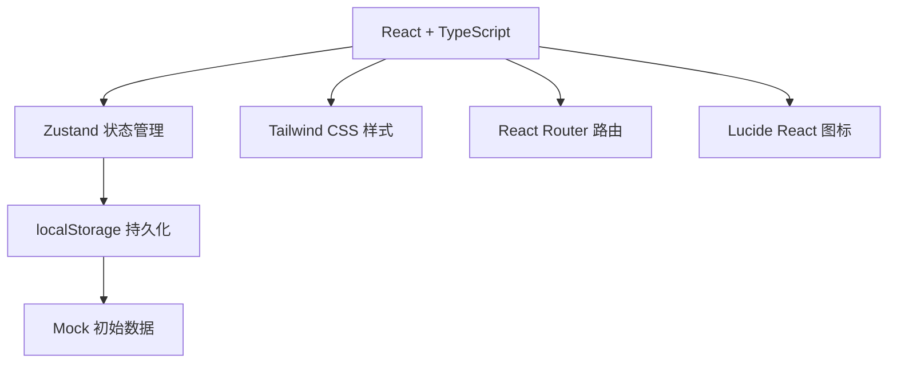

## 1. 架构设计

这是一个纯前端单页应用，无需后端服务，数据通过本地 Mock 数据初始化并使用 localStorage 持久化存储。



## 2. 技术描述

- **前端框架**：React 18 + TypeScript
- **构建工具**：Vite 5
- **样式方案**：Tailwind CSS 3
- **状态管理**：Zustand 4
- **路由方案**：React Router DOM 6
- **图标库**：Lucide React
- **数据存储**：localStorage + 初始 Mock 数据
- **无后端**：纯前端工具，数据本地存储

## 3. 路由定义

| 路由 | 页面 | 说明 |
|------|------|------|
| `/` | 待提醒页 | 默认首页，展示待提醒患者列表 |
| `/confirmed` | 已确认页 | 已提醒确认的患者，支持到诊/爽约操作 |
| `/followup` | 需跟进页 | 爽约患者列表，按风险优先级排序 |

## 4. 数据模型

### 4.1 患者预约数据模型

```typescript
interface Patient {
  id: string;
  name: string;
  phone: string;
  treatment: string;        // 复诊项目
  doctor: string;           // 主治医生
  appointmentTime: string;  // 预约时间 ISO 格式
  status: 'pending' | 'confirmed' | 'arrived' | 'no_show' | 'followup';
  reminderMethod?: 'sms' | 'phone' | 'wecom';  // 提醒方式
  remark?: string;          // 备注
  noShowReason?: 'forgot' | 'busy' | 'unreachable' | 'unwilling';  // 爽约原因
  lastTreatmentDate?: string;  // 上次治疗日期
  riskLevel?: 'high' | 'medium' | 'low';  // 风险等级
  riskTags?: string[];      // 风险标签，如 ["根管未完成", "正畸复诊超期"]
  createdAt: string;
  updatedAt: string;
}
```

### 4.2 状态枚举说明

- `pending`：待提醒，初始状态
- `confirmed`：已提醒确认，等待到诊
- `arrived`：已到诊
- `no_show`：爽约
- `followup`：需跟进（爽约后进入跟进状态）

### 4.3 爽约原因枚举

- `forgot`：忘记时间
- `busy`：临时有事
- `unreachable`：联系不上
- `unwilling`：不愿继续治疗

### 4.4 Mock 初始数据

提供 10~15 条模拟数据，覆盖：
- 当日待提醒患者 5~6 位
- 次日待提醒患者 3~4 位
- 已确认患者 3~4 位（含部分已到、部分未到）
- 需跟进患者 3~4 位（含不同风险等级）

## 5. 状态管理设计

### 5.1 Store 结构

```typescript
interface AppState {
  patients: Patient[];
  activeTab: 'pending' | 'confirmed' | 'followup';
  
  // Actions
  setActiveTab: (tab: 'pending' | 'confirmed' | 'followup') => void;
  addPatient: (patient: Omit<Patient, 'id' | 'createdAt' | 'updatedAt'>) => void;
  sendReminder: (id: string, method: 'sms' | 'phone' | 'wecom', remark?: string) => void;
  markArrived: (id: string) => void;
  markNoShow: (id: string, reason: 'forgot' | 'busy' | 'unreachable' | 'unwilling') => void;
  getPendingPatients: () => Patient[];
  getConfirmedPatients: () => Patient[];
  getFollowupPatients: () => Patient[];
}
```

### 5.2 持久化策略

- 使用 Zustand persist 中间件
- 存储 key：`dental-reminder-data`
- 首次加载时若无数据则使用 Mock 数据初始化

## 6. 组件结构

```
src/
├── components/
│   ├── Layout/
│   │   └── TabBar.tsx          # 顶部Tab导航
│   ├── Patient/
│   │   ├── PatientCard.tsx     # 患者卡片组件
│   │   └── PatientList.tsx     # 患者列表组件
│   ├── Modal/
│   │   ├── ReminderModal.tsx   # 提醒操作弹窗
│   │   └── NoShowModal.tsx     # 爽约原因弹窗
│   └── common/
│       └── Badge.tsx           # 标签组件
├── pages/
│   ├── PendingPage.tsx         # 待提醒页
│   ├── ConfirmedPage.tsx       # 已确认页
│   └── FollowupPage.tsx        # 需跟进页
├── store/
│   └── usePatientStore.ts      # Zustand store
├── types/
│   └── index.ts                # 类型定义
├── data/
│   └── mockData.ts             # Mock 数据
├── utils/
│   └── date.ts                 # 日期工具函数
├── App.tsx
├── main.tsx
└── index.css
```
